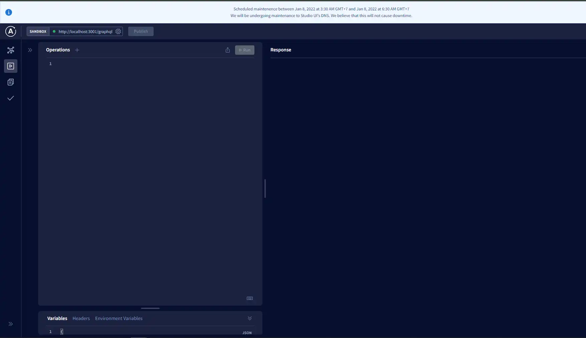

First you need to type `yarn init -y` or `npm init -y` in your terminal to generate package.json and also initialization your project.

```bash
yarn init -y
#or
npm init -y
```

install `Express`

```bash
yarn add express
```

install `Typescript` as a Dev depedency

```bash
yarn add -D typescript
```

install `ts-node-dev` to start the server as a dev depedency

```bash
yarn add -D ts-node-dev
```

don't forget to install the type definition because we are using Typescript and if you are using npm, type `npm install <package-name>--save-dev`.

```bash
yarn add -D @types/node @types/express @types/typescript
```

Afterwards install GraphQL and Apollo Express,because we are using Express

```bash
yarn add graphql apollo-server-express
```

Before getting started with `TypegraphQL`,we need to install some depedencies and slightly configure `tsconfig.json` to make TypegrahQL works.

First you need to install `class-validator` and `type-graphql`

```bash
yarn add class-validator type-graphql
```

Also,install `reflect-metadata` to make the type reflection work

```bash
yarn add reflect-metadata
```

For the `tsconfig.json` settings, i recommend you to check [@Ben Awad](<https://github.com/benawad/tsconfig.json/blob/master/src/config/tsconfig.node(Default).json>) tsconfig settings, because i usually use the settings for my projects.

After you copy the settings,change this part a little,because uses features from ES2018

```json
{
	"compilerOptions": {
		"lib": ["es2018", "esnext.asynciterable"]
	}
}
```

And the settings look like this

```json
{
	"compilerOptions": {
		"target": "es2018",
		"module": "commonjs",
		"lib": ["es2018", "esnext.asynciterable"],
		"skipLibCheck": true,
		"sourceMap": true,
		"outDir": "./dist",
		"moduleResolution": "node",
		"removeComments": true,
		"noImplicitAny": true,
		"strictNullChecks": true,
		"strictFunctionTypes": true,
		"noImplicitThis": true,
		"noUnusedLocals": true,
		"noUnusedParameters": true,
		"noImplicitReturns": true,
		"noFallthroughCasesInSwitch": true,
		"allowSyntheticDefaultImports": true,
		"esModuleInterop": true,
		"emitDecoratorMetadata": true,
		"experimentalDecorators": true,
		"resolveJsonModule": true,
		"baseUrl": "."
	},
	"exclude": ["node_modules"],
	"include": ["./src/**/*.tsx", "./src/**/*.ts"]
}
```

And lastly install Typeorm as an ORM,because Typeorm works really well with `Typegrapqhl` and `Typescript` , You can use another ORM such as Prisma 2,sequalize,and etc.

```bash
yarn add typeorm
```

After All depedencies are installed we can start to write our code.

First we need to check Express Typescript server whether works or not.

```typescript
import express from "express";

const app = express();
app.get("/", (_req, res) => {
	res.send("server running on express");
});

app.listen(3001, () => {
	console.log("🚀 Server ready at http://localhost:3001");
});
```

To start the server we are gonna using `ts-node-dev` , and create the script in package.json looks like this.

```json
	"scripts": {
		"start": "ts-node-dev --respawn --transpile-only src/index.ts"
	},
```

Type this command to execute the script

```bash
yarn start
```

Afterwards visit http://localhost:3001. If you see the massage, then you have successfully setup Express Typescript server.

After finished setup Express Server, Next we are going to setup Apollo Graphql Server with TypegrapQL and write our first Graphql Resolver.

```typescript
import "reflect-metadata";
import { ApolloServer } from "apollo-server-express";
import express from "express";
import { Mutation, Query, Resolver, buildSchema } from "type-graphql";

//Graphql Resolver
@Resolver()
class TestResolver {
	@Mutation(() => String)
	async testMutation(): Promise<string> {
		return "Sheesh Mutation";
	}
	@Query(() => String)
	async testQuery(): Promise<string> {
		return "Sheesh Query";
	}
}

async function startApolloServer() {
	const app = express();
	const schema = await buildSchema({
		resolvers: [TestResolver],
	});
	app.get("/", (_req, res) => {
		res.send("server running on express");
	});
	const server = new ApolloServer({
		schema,
		context: ({ req, res }) => ({ req, res }),
	});
	await server.start();
	server.applyMiddleware({ app });
	app.listen(3001, () => {
		console.log(
			`🚀 Server ready at http://localhost:3001${server.graphqlPath}`
		);
	});
}
startApolloServer();
```

And then type `yarn start` again. Afterwards visit http://localhost:3001/graphql.
if you see this UI.



then **congratulations** you have successfully setup Apollo GraphQL server.And now you can write your graphQL query Like This.

```bash
query test{
  testQuery
}

Mutation test{
  testQuery
}
```

Lastly we are gonna using typeORM to connect to the Database.In this example i'm using PostgreSQL,but you can use any Database you want.

First create `ormconfig.json` on the root folder,then create configuration like this,for more information visit [Using ormconfig.json](https://typeorm.io/#/using-ormconfig)

```json
{
	"type": "postgres",
	"host": "localhost",
	"port": 5432,
	"username": "postgres",
	"password": "postgres",
	"database": "library-app",
	"synchronize": true,
	"logging": true,
	"entities": ["src/entities/*.*"]
}
```

i will explain briefly,but if you want to read the full docs visit the link on the top.

As you can see i use postgres database in port 5432 ,and i set `synchronize : true` it means everytime i make a change to my entities , Typeorm will sync with the database everytime i run my app.

i also set `logging : true` to print the logs everytime i make query to the database the logs will be print to the console.

and lastly i place my entities into `src/entities` folder.

afterwards we are gonna create a connection.

First Import createConnection from `typeorm`

```typescript
import { createConnection } from "typeorm";
```

And place createConnection inside `startApolloServer()` function.

```typescript
import "reflect-metadata";
import { ApolloServer } from "apollo-server-express";
import express from "express";
import { Mutation, Query, Resolver, buildSchema } from "type-graphql";
import { createConnection } from "typeorm";

@Resolver()
class TestResolver {
	@Mutation(() => String)
	async testMutation(): Promise<string> {
		return "Sheesh Mutation";
	}
	@Query(() => String)
	async testQuery(): Promise<string> {
		return "Sheesh Query";
	}
}

async function startApolloServer() {
	await createConnection();
	const app = express();
	const schema = await buildSchema({
		resolvers: [TestResolver],
	});
	app.get("/", (_req, res) => {
		res.send("server running on express");
	});
	const server = new ApolloServer({
		schema,
		context: ({ req, res }) => ({ req, res }),
	});
	await server.start();
	server.applyMiddleware({ app });
	app.listen(3001, () => {
		console.log(
			`🚀 Server ready at http://localhost:3001${server.graphqlPath}`
		);
	});
}
startApolloServer();
```

Next we are gonna make our first entitiy ,in this example im gonna create user entity.

First create user.ts inside entities folder

```typescript
import { Field, ID, ObjectType, registerEnumType } from "type-graphql";
import {
	Entity,
	PrimaryGeneratedColumn,
	Column,
	BaseEntity,
	CreateDateColumn,
} from "typeorm";

@ObjectType()
@Entity()
export class User extends BaseEntity {
	@Field((_type) => ID)
	@PrimaryGeneratedColumn("uuid")
	id!: string;

	@Field()
	@Column({ unique: true })
	name!: string;

	@Field()
	@Column({ unique: true })
	email!: string;

	@Column()
	password!: string;

	@Field()
	@CreateDateColumn()
	createdAt!: Date;
}
```

In this example, i created User table which has simple column such as name,email,password and createdAt.

next we are going to call the entity and combine it with Typegraphql.

In this example i created simple Register Mutation,and also i use `bcryptjs` to hash the user password.

```typescript
import { Arg, Mutation, Resolver } from "type-graphql";
import * as bcrypt from "bcryptjs";
import { User } from "../../entities/user";

@Resolver(User)
export class RegisterResolver {
	@Mutation(() => User)
	async register(@Arg("input") id: RegisterInput): Promise<User> {
		const hashedPassword = await bcrypt.hash(input.password, 12);
		const user = await User.create({
			name: input.name,
			email: input.email,
			password: hashedPassword,
		}).save();
		return user;
	}
}
```

Refrences :

- https://www.youtube.com/playlist?list=PLN3n1USn4xlma1bBu3Tloe4NyYn9Ko8Gs
- https://typegraphql.com/docs/installation.html
- https://github.com/benawad/tsconfig.json
- https://typeorm.io/#/using-ormconfig
